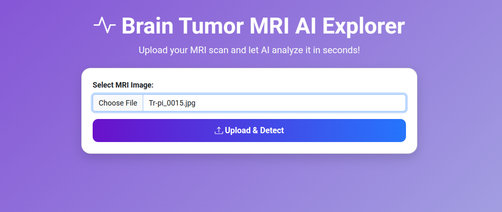
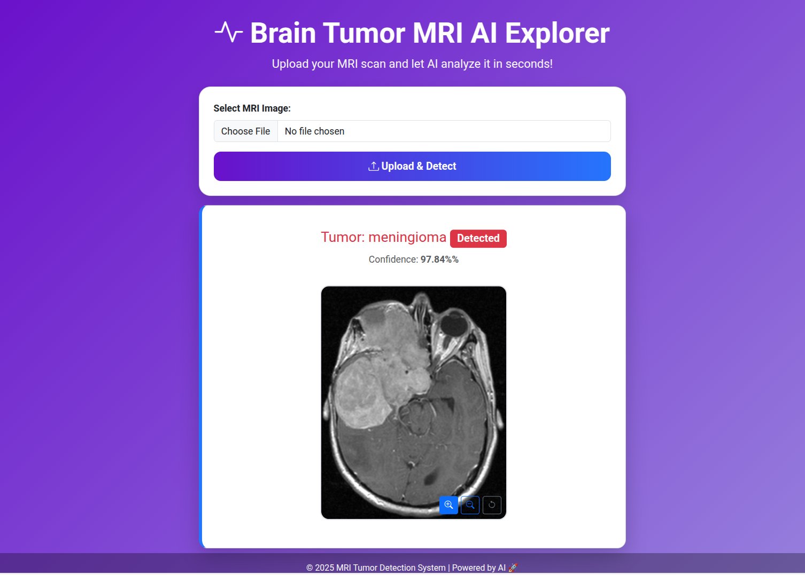

## 🧠 Brain Tumor Detection End-to-End ML Project

This repository contains an **end-to-end machine learning project** for detecting brain tumors from MRI images using a Convolutional Neural Network (CNN). The project includes data preprocessing, model training, evaluation, and a web interface to predict tumors on uploaded images.

---

## 📁 Project Structure

```plaintext
brain-tumor-detection-computer-vision/
│
├── dataset/                        # MRI brain images dataset
│   ├── Training/
│   │   ├── glioma/
│   │   ├── meningioma/
│   │   ├── notumor/
│   │   └── pituitary/
│   └── Testing/
│       ├── glioma/
│       ├── meningioma/
│       ├── notumor/
│       └── pituitary/
│
├── model/
│   └── model.h5                     # Trained CNN model
│
├── templates/
│   └── index.html                   # Web interface template
│
├── uploads/                         # Temporary storage for uploaded images
│
├── main.py                          # FastAPI/Flask web application
├── script.ipynb                     # Jupyter notebook for training and evaluation
├── requirements.txt                 # Python dependencies
└── Dockerfile                       # Docker configuration
```

## 📂 Folder Overview

- `dataset/` → Contains MRI images divided into **training** and **testing** sets.  
  - Dataset Source: Downloaded from [Kaggle - Brain Tumor MRI Dataset](https://www.kaggle.com/datasets/masoudnickparvar/brain-tumor-mri-dataset) or you can use any other relevant brain MRI dataset. 
- `model/` → Stores the trained CNN model (`model.h5`).  
- `templates/` → HTML templates for the web interface.  
- `uploads/` → Temporary storage for uploaded images.  
- `main.py` → Web application to serve predictions.  
- `script.ipynb` → Jupyter notebook for training and evaluating the model.  
- `requirements.txt` → Project dependencies.  
- `Dockerfile` → Docker configuration for deployment.

---

## ⚙️ Features

- Train a **CNN model** (VGG16-based transfer learning) on brain MRI images.  
- Detect 4 classes: **glioma, meningioma, pituitary tumor, no tumor**.  
- Predict tumor type for uploaded images using a web interface.  
- Visualize model performance:
  - Accuracy and Loss plots
  - Classification report
  - Confusion matrix
  - ROC Curve and AUC
- Deployable using **Docker**.

---

## 🛠️ Prerequisites

Before running the project, ensure you have the following installed:

- **Python 3.x**  
- **pip** (Python package installer)  
- **Virtual Environment** (Optional, but recommended)  
- **Docker** (Optional, for containerized deployment)

---

## 🚀 Project Setup

### Step 1: Clone the Repository

```bash
git clone https://github.com/khizraghaffarkk/brain-tumor-detection-computer-vision.git
cd brain-tumor-detection-computer-vision
```
### Step 2: Set Up a Virtual Environment

```bash
python3 -m venv venv
source venv/bin/activate
```
### Step 3: Install Dependencies

```bash
pip install -r requirements.txt
```
### 🏃 Running the Web Application
Run the web app:
```bash
python main.py
```

Open your browser and go to:
```bash
http://127.0.0.1:8000
```
Upload an MRI image to detect tumor type and confidence score.

## 🧠 Training the Model

Use `script.ipynb` to train the CNN model using transfer learning (VGG16).  
Save the trained model as `model/model.h5`.

### Visualizations include:

- **Training accuracy and loss**
- **Classification report**
- **Confusion matrix**
- **ROC curves**

## 📊 Model Evaluation

- **Classification Report**: Shows precision, recall, f1-score, and support for each class.  
- **Confusion Matrix**: Visualizes correct vs incorrect predictions for each class.  
- **ROC Curve & AUC**: Evaluates the model’s ability to distinguish each class.

## 🐳 Docker Deployment

To run the project in a Docker container:

```bash
docker build -t brain-tumor-detection .
docker run -p 8000:8000 brain-tumor-detection
```

## 🖥️ User Interface

This is the web interface where users can interact with the system to make predictions.  
Users can upload MRI images and get predictions of tumor type along with the confidence score.

### Upload Page


### Prediction Result
  

